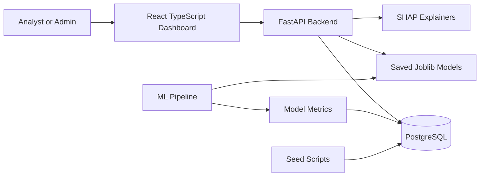
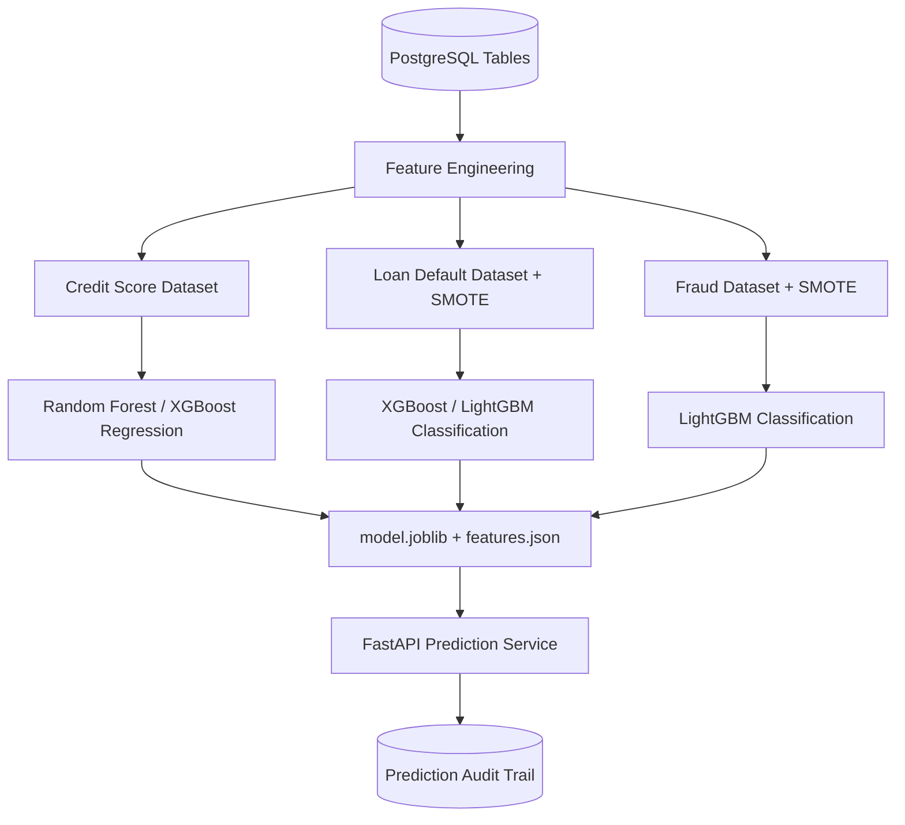
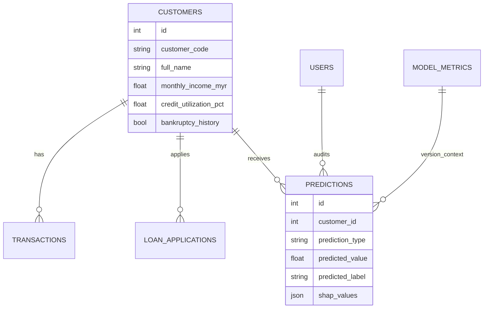
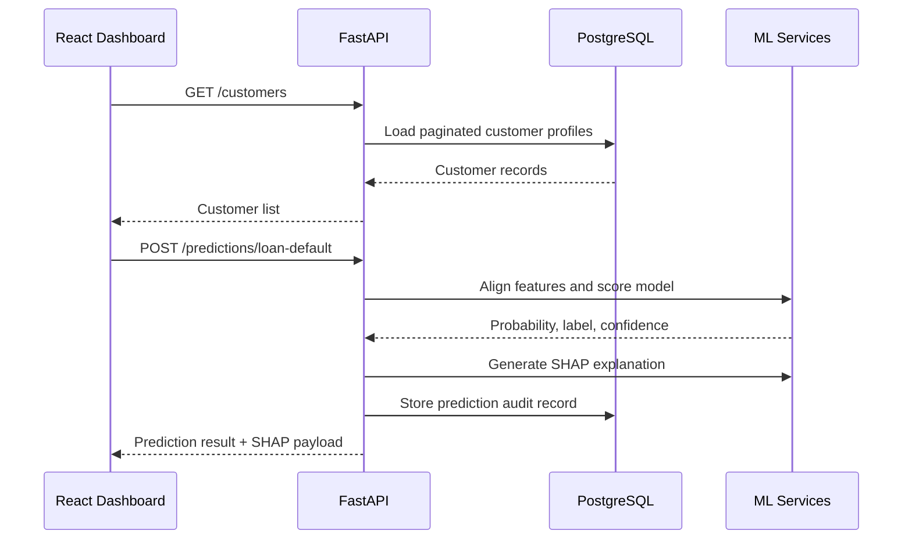

# CreditIQ

CreditIQ is a full-stack credit intelligence platform for credit score prediction, loan default risk assessment, fraud detection, and model analytics. It combines a FastAPI backend, PostgreSQL persistence, ML training pipelines, SHAP explainability, and a responsive React dashboard.

## Features

- Customer portfolio management with paginated search and risk profiles
- Credit score prediction with SHAP feature explanations
- Loan default probability scoring with risk recommendations
- Real-time fraud detection workflow
- Model monitoring dashboard with metrics, distributions, and feature importance
- Prediction audit trail stored in PostgreSQL
- React dashboard with dark mode, accessible controls, CSV export, and print support
- ML pipeline using scikit-learn, XGBoost, LightGBM, Optuna, MLflow, SMOTE, and SHAP

## Tech Stack

**Backend:** Python 3.11, FastAPI, SQLAlchemy 2.0 async, Alembic, PostgreSQL, Pydantic  
**ML:** XGBoost, LightGBM, scikit-learn, Optuna, MLflow, SHAP, imbalanced-learn  
**Frontend:** React 18, TypeScript, Vite, Zustand, Axios, React Router, Recharts, Plotly.js, Vitest  

## System Charts

### Platform Architecture



### ML Training and Prediction Flow



### Core Data Model



### Dashboard Data Flow



### Model Coverage

| Model | Task | Algorithm Candidates | Output | Explainability |
| --- | --- | --- | --- | --- |
| Credit Score | Regression | Random Forest, XGBoost | Score from 300 to 850 | SHAP top feature impacts |
| Loan Default | Classification | XGBoost, LightGBM | Default probability + label | SHAP risk breakdown |
| Fraud Detection | Classification | LightGBM | Fraud probability + label | SHAP anomaly indicators |

## Project Structure

```text
backend/            FastAPI app, async database setup, routers, Alembic
ml_pipeline/        Data preparation and training scripts
data/seeds/         Database and dashboard seed scripts
saved_models/       Model output folders
frontend/           React TypeScript dashboard
```

## Setup

### 1. Backend environment

Create a virtual environment and install the Python dependencies you use for the project:

```powershell
python -m venv .venv
.\.venv\Scripts\activate
pip install fastapi uvicorn sqlalchemy asyncpg psycopg2-binary alembic python-dotenv python-jose passlib[bcrypt] bcrypt==4.0.1 pandas scikit-learn imbalanced-learn xgboost lightgbm optuna mlflow shap joblib faker
```

Copy the environment template:

```powershell
Copy-Item backend\.env.example backend\.env
```

Update `backend/.env` with your PostgreSQL password.

### 2. Database

Create the PostgreSQL database:

```sql
CREATE DATABASE creditiq;
```

Run migrations from the backend folder:

```powershell
cd backend
alembic upgrade head
```

Seed demo data from the project root:

```powershell
python data\seeds\seed.py
python data\seeds\seed_dashboard_data.py
```

### 3. ML pipeline

Prepare data:

```powershell
python ml_pipeline\data_prep.py
```

Train models:

```powershell
python ml_pipeline\train_credit_score.py
python ml_pipeline\train_default.py
python ml_pipeline\train_fraud.py
```

Training scripts save models under `saved_models/` and write model metrics into PostgreSQL.

### 4. Run backend

From `backend/`:

```powershell
python -m uvicorn app.main:app --reload
```

API docs:

```text
http://localhost:8000/docs
```

### 5. Run frontend

From `frontend/`:

```powershell
npm install
npm run dev
```

Dashboard:

```text
http://localhost:5173/dashboard
```

If Vite uses another local port, the backend CORS config allows local dev ports.

## Frontend Quality Checks

```powershell
cd frontend
npm run lint
npm test
npm run build
```

## API Highlights

- `GET /health`
- `GET /customers`
- `GET /customers/{customer_id}`
- `POST /predictions/credit-score`
- `POST /predictions/loan-default`
- `POST /predictions/fraud`
- `GET /analytics/model-performance`
- `GET /analytics/prediction-distribution`
- `GET /analytics/top-risk-customers`
- `GET /analytics/customer-insights/{customer_id}`
- `GET /analytics/feature-importance/{model_type}`

## Notes

Local secrets, generated datasets, MLflow output, SQLite tracking database, frontend build files, and trained model binaries are intentionally ignored by git. The source code and folder placeholders are committed so the project can be rebuilt locally.
